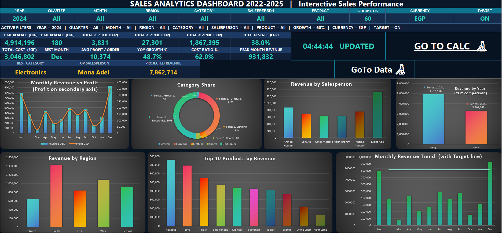

# Sales Analytics Dashboard 2022–2025

Interactive Excel sales performance dashboard with a fully dynamic KPI layer,
drill-down filters, YoY growth engine, currency toggle, and 7 live charts.

---

## Overview

This is a self-contained Excel workbook that turns **720 sales transactions**
(2022–2025) into an interactive executive dashboard. It uses an in-cell
filter system (Year / Quarter / Month / Region / Category / Salesperson /
Product), a dedicated formula engine sheet, and linked charts that all
re-calculate instantly when a filter changes — no macros required.

| Dimension | Values |
|---|---|
| Years | 2022, 2023, 2024, 2025 |
| Regions | North, South, East, West, Central |
| Categories | Electronics, Furniture, Clothing, Sports, Grocery |
| Products | 25 SKUs |
| Salespeople | 6 |
| Transactions | 720 records (180 per year, 15 per month) |

## Key Performance Indicators

All KPIs are computed live from the active filters (default view = **Year 2024**):

| KPI | Value |
|---|---|
| Total Revenue | 4,914,196 EGP |
| Total Cost | 3,046,802 EGP |
| Total Profit | 1,867,395 EGP |
| Profit Margin | 38% |
| Total Orders | 180 |
| Total Units | 3,831 |
| Avg Order Value | 27,301 EGP |
| Avg Profit / Order | 10,374 EGP |
| YoY Growth | +48.7% |
| Best Month | December |
| Peak Month Revenue | 931,832 EGP |
| Best Category | Electronics (49.6% share) |
| Top Salesperson | Mona Adel (27.2% share) |

Full-dataset totals: **Revenue 14,974,642 EGP — Profit 5,689,164 EGP** across all 4 years.

## Interactive Filters

The dashboard is driven entirely from a single control strip:

- **Year, Quarter, Month, Region, Category, Salesperson, Product** — data-validation dropdowns (fed from the `Calc` sheet, "All" included)
- **Growth %** — sets a revenue growth target (0–100%) used to compute **Projected Revenue**
- **Currency** — toggles the report between **EGP** and **USD**
- **Target** — On / Off switch for the target overlay
- An **"Active Filters"** line always shows exactly what is applied

## Workbook Structure

### 1. `Dashboard`
The visible, formatted report:
- Title block + "last updated" timestamp
- Filter controls and active-filter summary
- 12 KPI cards + highlights (Best Month, Best Category, Top Salesperson, Projected Revenue)
- **7 charts**: revenue trends, quarter/region/category breakdowns, top & bottom products, heatmap matrix, and more

### 2. `Data`
The raw fact table (Excel Table), one row per transaction:
`Date, Year, Quarter, MonthNum, Month, Region, Category, Product, Salesperson, Units, Unit Price, Revenue, Cost, Profit`

### 3. `Calc`
A read-only **formula engine layer** (17 sections) that powers the dashboard:

| # | Section | Purpose |
|---|---|---|
| 1 | Current Selections | Mirrors the dashboard controls (engine + readable) |
| 2 | Dropdown List Sources | Feeds all in-cell dropdowns |
| 3 | Monthly Totals | Revenue / Orders / Units / Cost by month |
| 4 | Quarter Totals | Revenue / Orders / Units / Profit by quarter |
| 5 | Region Totals | Revenue, orders, units and revenue share % |
| 6 | Category Totals | Revenue, profit, margin % and share % |
| 7 | Salesperson Totals | Revenue, orders, units and share % |
| 8 | Product Totals | All 25 SKUs (+ margin %) |
| 8b | Top 10 Products | Auto-ranked by revenue |
| 9 | Year Totals | Yearly revenue / profit for YoY comparison |
| 10 | Region × Category Matrix | Revenue cross-tab, heatmap source |
| 11 | Currency View | EGP ↔ USD conversion output |
| 12 | Growth % Values | 0–100 step-5 list for the growth dropdown |
| 13 | KPI Helpers | YoY growth engine (latest vs previous year) |
| 14 | Bottom 5 Products | Auto-ranked by revenue |
| 15 | Top 5 by Profit | Highest absolute profit |
| 16 | Year Compare | Latest vs previous year Δ% |
| 17 | Extra Order Metrics | Avg orders/month, units/order, best quarter, etc. |

## Highlights From the Data

- **Best quarter:** Q4 — 1,397,479 EGP revenue (28% of the year)
- **Best category:** Electronics dominates with **49.6%** of revenue
- **Top seller:** Mona Adel drives **27.2%** of total revenue
- **Top product:** Headset — 759,688 EGP
- **Peak month:** December — 931,832 EGP
- **YoY growth (2024 vs 2023):** +48.7%

## How to Use

1. Open `Sales Analytics Dashboard - FINAL.xlsx` in Excel (desktop or web).
2. Change any dropdown in the filter strip on the `Dashboard` sheet.
3. Every KPI, chart, and the Active Filters line update instantly.
4. Open the `Calc` sheet to inspect or extend the formula engine.
5. Toggle **Currency** or **Growth %** to re-baseline the projections.

> No macros, no external data sources, no add-ins — pure formulas and data validation.

## Files

| File | Description |
|---|---|
| `Sales Analytics Dashboard - FINAL.xlsx` | The complete interactive dashboard workbook |
| `dashboard-preview.png` | Read-only screenshot of the dashboard |
| `Screenshot 2026-09-17 044553.png` | Original capture saved during build |

## Built With

- Microsoft Excel (formulas: SUMIFS, INDEX/MATCH, XLOOKUP, aggregation + data validation)
- Chart objects, conditional formatting (heatmap), named ranges